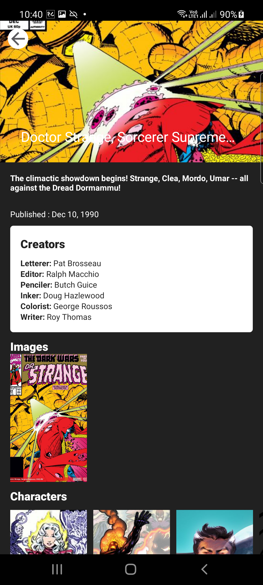

# Test assignment for Baby2Body

Introduction
-------------

Create public and private keys from [MARVEL API](https://developer.marvel.com/)

# Features
Listing comics based on year. Currently showing the list from 1950 to current year.
This app supports offline mode and orientation change.

The app is composed of 2 main screens.
#### ComicListFragment

Allows you to list comic based on the year selection on Marvel API.
Each result is kept in the database in `PaginationEntity` table where
the list of comic IDs are denormalized into a single column.
The actual `Comic` instances live in the `ComicEntity` table.

Each time a new page is fetched, the same `PaginationEntity` record in the
Database is updated with the new list of comic ids.

**NOTE** The UI currently loads all `ComicEntity` items at once.

#### ComicDetailFragment

This fragment displays the details of a comic and respective characters(if any).

# Development Environment

The app is written entirely in Kotlin and uses the Gradle build system.

To build the app, use the `gradlew build` command or use "Import Project" in
Android Studio. A stable version >= 4 of Android Studio is
required and may be downloaded
[here](https://developer.android.com/studio/).

# Architecture

The architecture is built around
[Android Architecture Components](https://developer.android.com/topic/libraries/architecture/).

We followed the recommendations laid out in the
[Guide to App Architecture](https://developer.android.com/jetpack/docs/guide)
when deciding on the architecture for the app. We kept logic away from
Activities and Fragments and moved it to
[ViewModel](https://developer.android.com/topic/libraries/architecture/viewmodel)s.

We observed data using
[LiveData](https://developer.android.com/topic/libraries/architecture/livedata)
and used the [Data Binding Library](https://developer.android.com/topic/libraries/data-binding/)
to bind UI components in layouts to the app's data sources.

We used [Navigation component](https://developer.android.com/guide/navigation)
to simplify into a single Activity app.

We used [Room](https://developer.android.com/jetpack/androidx/releases/room)

We used [Dagger2](https://github.com/google/dagger) for dependency injection
and we heavily relied on
[dagger-android](https://google.github.io/dagger/android.html) to abstract away
boiler-plate code.

Also, we have used following tools as :
* [Retrofit](https://square.github.io/retrofit/) for REST api communication
* [Glide](https://bumptech.github.io/glide/) for image loading
* [Timber](https://github.com/JakeWharton/timber) for logging

## Kotlin

We made an early decision to rewrite the app from scratch to bring it in line
with our thinking about modern Android architecture. Using Kotlin for the
rewrite was an easy choice: we liked Kotlin's expressive, concise, and
powerful syntax; we found that Kotlin's support for safety features for
nullability and immutability made our code more resilient; and we leveraged the
enhanced functionality provided by
[Android Ktx extensions](https://developer.android.com/kotlin/ktx).

# Copyright
    © Copyright 2021. All Rights Reserved.
